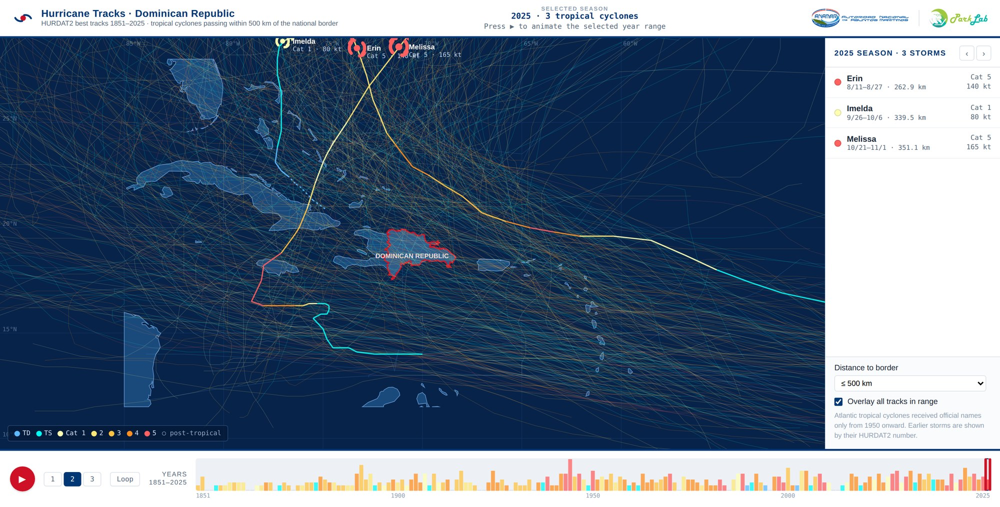

# Hurricane Tracks · Dominican Republic (1851–2025)

An interactive web visualization of every Atlantic tropical cyclone that passed within **500 km of the Dominican Republic's national border** between 1851 and 2025, built from NOAA's HURDAT2 best-track database.

**Live site:** https://osgeokr.github.io/hurricane-tracker-dr/



## What the site shows

The visualization presents 174 years of tropical cyclone activity around the Dominican Republic on a single map, with the national border outlined in red and all storm tracks colored by their Saffir–Simpson intensity.

You can step through the record season by season or press play to animate a selected year range from 1851 to 2025, with adjustable speed and an optional loop. For any season, a side panel lists the storms that came within range, each with its active dates, minimum distance to the national border, peak category, and peak sustained wind. A "distance to border" control lets you tighten the selection from the full 500 km screening radius down to stricter thresholds, and an overlay option renders every track in the selected range at once so long-term spatial patterns become visible. A yearly frequency histogram along the bottom summarizes how activity has changed across the full record.

The entire application is a single self-contained HTML file with the storm data embedded directly in it, so it runs from any static host with no build step, server, or external dependencies.

## Data and methods

The visualization is the product of a two-stage geospatial pipeline. The source is the **HURDAT2 Atlantic hurricane database** published by the NOAA National Hurricane Center (https://www.nhc.noaa.gov/data/#hurdat), covering 1851–2025.

### Stage 1 — Parsing HURDAT2 into a spatial dataset

HURDAT2 is distributed as a hierarchical text file rather than a flat table: each storm is introduced by a header row (storm ID, name, and a count of following records), which is then followed by that many observation rows. A custom parser reads the file line by line, propagating each header's storm identity onto its observation rows so that every observation becomes an independent, fully-attributed record.

During parsing, three normalization steps prepare the data for geospatial use. Hemisphere-suffixed coordinates such as `28.0N` / `94.8W` are converted to signed decimal degrees (EPSG:4326, WGS 84); the sentinel value `-999` is converted to proper NULLs so it is never mistaken for a real measurement; and the separate date and time columns are combined into a single UTC timestamp suitable for temporal animation. A **Saffir–Simpson category** field is then derived from maximum sustained wind, since the raw data does not carry one.

The parsed data is written to a GeoPackage with two layers: `track_points`, holding all **55,605 observations** across **2,004 storms** with their full attributes, and `track_lines`, holding one summarized path geometry per storm (**1,973 storms** with two or more fixes), carrying peak wind, minimum pressure, peak category, and a landfall flag.

### Stage 2 — Selecting storms near the Dominican Republic

Dominican Republic administrative boundaries (ADM0–ADM4, from the Humanitarian Data Exchange) are consolidated into a single GeoPackage, and a **500 km buffer** is generated around the national border (ADM0). The buffer and all distance calculations are performed in a metric projection (UTM Zone 19N, EPSG:32619) rather than in geographic degrees, so distances are measured correctly in meters.

Every storm whose track intersects the buffer is selected, yielding **459 storms and 17,427 observations** spanning the full 1851–2025 record. For each selected storm, a `min_dist_km` attribute records the shortest distance from its track to the national border. Storing this distance as an attribute means any stricter radius can be applied later as a simple filter, without re-running the extraction.

### Why 500 km

The 500 km radius is a standard screening distance in tropical-cyclone rainfall research rather than an arbitrary choice. A 2025 systematic review in *Natural Hazards* found that 54 of 91 distance-based studies adopted 500 km. The physical basis is Englehart & Douglas's observation that in roughly 90% of tropical cyclones the outer cloud band lies within 550–600 km of the center. Neighboring Puerto Rico studies (Hernández Ayala & Matyas 2016; Keellings & Hernández Ayala 2019; Boose et al. 2004) applied the same 500 km island-based selection radius.

For narrower analyses, Hernández Ayala & Matyas (2016) identified a center-distance threshold of roughly 233 km for storms that produce heavy rainfall, so the `min_dist_km` attribute supports a literature-defensible tightening to 233 km (or 250 km) directly on the data.

The table below summarizes the selected storms by distance band, with the cumulative column showing how many storms remain under each threshold.

| Distance to border | Storms | Major (Cat 3+) | Cumulative |
|---|---:|---:|---:|
| 0–50 km | 100 | 43 | 100 |
| 50–100 km | 39 | 15 | 139 |
| 100–150 km | 34 | 9 | 173 |
| 150–200 km | 43 | 16 | 216 |
| 200–250 km | 34 | 19 | 250 |
| 250–300 km | 40 | 12 | 290 |
| 300–400 km | 76 | 21 | 366 |
| 400–500 km | 91 | 30 | 457 |

## Running locally

Because the site is a single self-contained file, you can simply open `index.html` in any modern browser, or serve the folder with any static server:

```bash
python3 -m http.server 8000
# then visit http://localhost:8000
```

## Data sources and credits

Storm data: NOAA National Hurricane Center, HURDAT2 Atlantic best-track database (1851–2025). Administrative boundaries: Humanitarian Data Exchange (HDX). The header of the visualization credits the Autoridad Nacional de Asuntos Marítimos (ANAMAR) and ParkLab.

## License

Unless a `LICENSE` file specifies otherwise, all rights are reserved by the author. The underlying HURDAT2 data is in the public domain as a U.S. government work.
